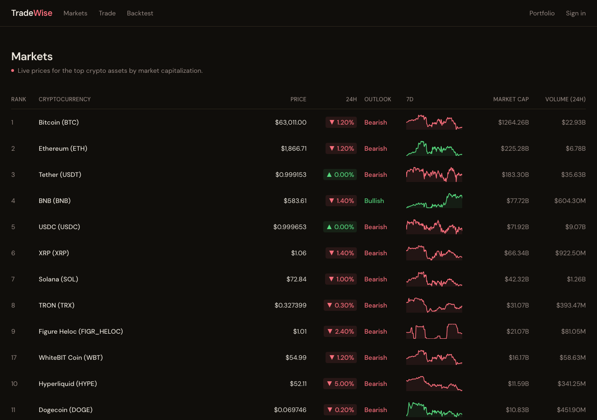
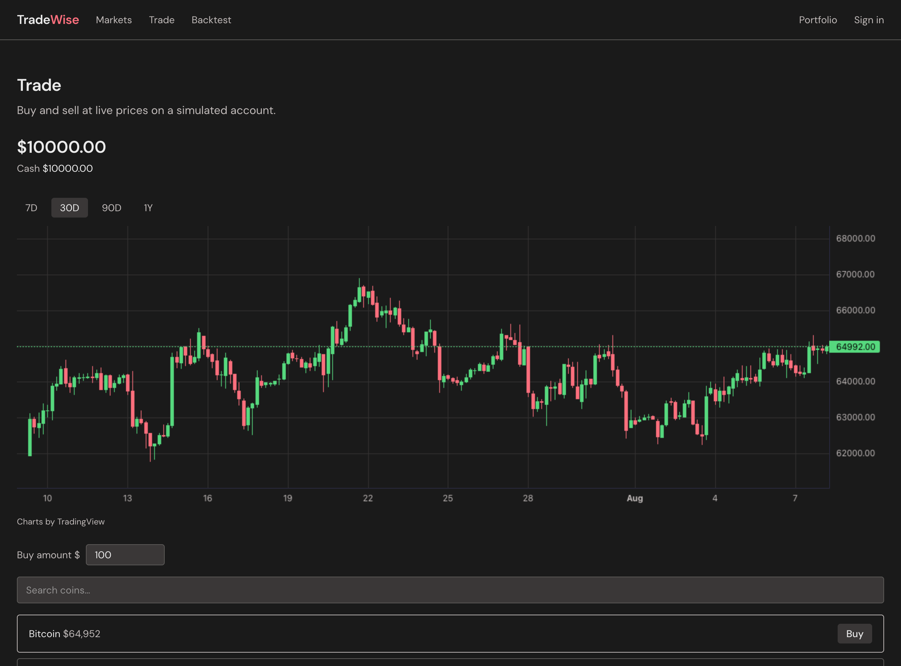
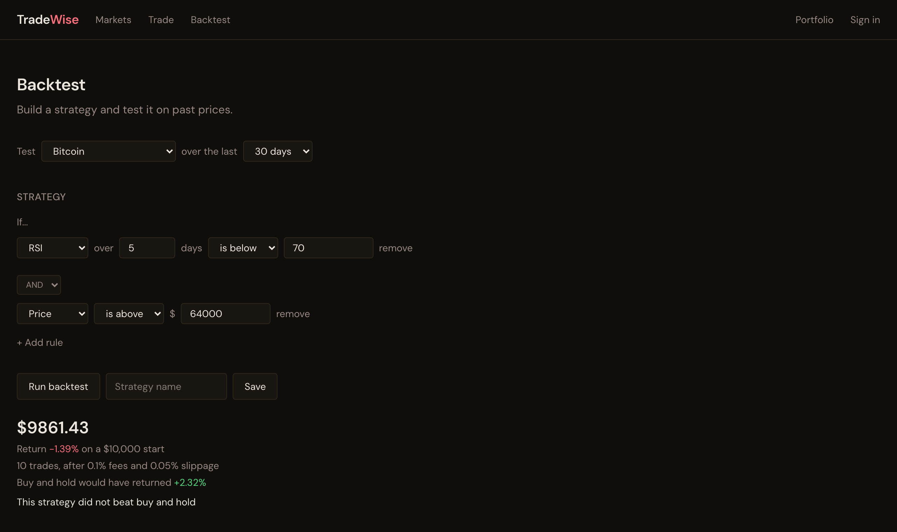

# TradeWise

**Live demo:** https://tradewise-app.vercel.app

## Overview

TradeWise is a crypto strategy backtester. You put together a strategy from indicator
rules, run it against past prices, and see what it would have made. Fees and slippage
come out of every trade, and the result is shown next to what you'd have got from just
buying the coin and holding it. The project also includes a paper trading account that
lets users manually trade with live prices on a simulated portfolio.

 

## Features

- Build strategies from Price, SMA, EMA, RSI and Bollinger Bands
- Join rules with AND/OR
- Backtest over 30 days, 90 days or a year of CoinGecko data
- Every result is compared against buy-and-hold
- Optional stop-loss and take-profit on a backtest
- Every result shows the worst drop along the way
- Chart of the account value over the backtest, next to buy-and-hold
- Paper trading with a simulated $10,000 account, searching across the top 250 coins
- Live prices on the trade page from a Coinbase WebSocket, polling for the rest
- Markets table with price, 24h change, market cap, volume and a 7 day sparkline,
  refetched every 30 seconds
- Candlestick charts on 7D, 30D, 90D and 1Y
- Sign in to save strategies and keep your portfolio

## Backtest Engine

The backtest engine is written in C++. Each strategy is represented as a tree. The AND/OR
groups contain child rules, and the tree is recursively evaluated for each day of
historical price data. FastAPI receives requests from the frontend, runs the C++ program,
and returns the results.

Recent backtesting updates include changing trade execution to use the next day's closing
price instead of the same day's close. Originally, trades were using a price that would
not have been known yet when the signal was generated, which made results look better
than they should. I also added checks so indicators like a 50-day moving average do not
run until enough historical data is available. These changes helped make the backtest
results more realistic.

You can also give a backtest a stop-loss or a take-profit. The engine remembers the price
it bought at, and if the price moves past either of those it sells the next day whatever
the rules say. After being stopped out it waits for the rules to go false before buying
again, otherwise it would just buy straight back in. Every run also reports the worst drop
from a high point, so a strategy is judged on what it put you through and not only where
it ended up.

## Tech Stack

- **Frontend:** Next.js 16 (App Router), React 19, TypeScript, Tailwind v4
- **Backtest engine:** C++17, nlohmann/json vendored as `engine/cpp/json.hpp`
- **API:** FastAPI and uvicorn
- **Data:** CoinGecko, plus a Coinbase WebSocket for live prices on the trade page
- **Authentication and database:** Supabase
- **Charts:** lightweight-charts v5
- **Deployment:** Vercel for the site, Render for the engine

The browser never calls CoinGecko directly. Requests either go through my own `/api`
routes or happen while the page is being rendered on the server, so the key stays on the
server either way.

The trade page also opens a WebSocket to Coinbase for live prices. It works out which
markets Coinbase has by turning each coin's symbol into a name like BTC-USD, which covers
around 100 of the top 250. The 30 second refresh stays underneath, so a coin Coinbase
doesn't list, or a dropped connection, just falls back to polled prices.

The engine is on Render's free tier, so it sleeps after 15 minutes of no traffic. The
first backtest after that can take around a minute while it starts back up.

## Project Structure

```
web/
  src/app/            pages, plus api/ routes and server actions
  src/components/     navbar, markets table, charts, sparkline
  src/lib/            coingecko client, supabase clients
engine/
  main.py             fastapi wrapper
  cpp/evaluator.cpp   the backtest itself
```

## Getting Started

You need a `web/.env.local` with `COINGECKO_API_KEY`, `NEXT_PUBLIC_SUPABASE_URL`,
`NEXT_PUBLIC_SUPABASE_PUBLISHABLE_KEY` and `NEXT_PUBLIC_ENGINE_URL`.

```bash
cd web
npm install
npm run dev
```

The C++ has to be compiled before the engine will run.

```bash
cd engine
pip install -r requirements.txt
g++ -std=c++17 -o cpp/evaluator cpp/evaluator.cpp
uvicorn main:app --port 8000
```

When the engine is deployed it also needs `SITE_URL` set to the site's address, since the
browser calls the engine directly and CORS has to allow that origin. Locally it already
allows `http://localhost:3000`.

## Tests

The engine includes a small set of tests in `engine/test_engine.py`. Each test creates a
small strategy and price series with a known expected result, runs the compiled C++
engine, and checks that the output matches. The tests cover the AND/OR strategy tree,
SMA behavior, indicators waiting for enough history, and next-day trade execution.

```bash
cd engine
python test_engine.py
```

## Example

Hold Bitcoin while the 5 day RSI is under 70 and the price is above 64000, tested on 30
days of closes:



The same strategy against the engine directly:

```bash
curl -X POST http://localhost:8000/backtest \
  -H "Content-Type: application/json" \
  -d '{
    "prices": [62554, 63088, 63586, 64001, 63335, 62247, 63193, 64111, 63791, 63747,
               62279, 64984, 64717, 63792, 63905, 64796, 64670, 65185, 66521, 66077,
               65033, 64099, 64316, 65310, 63674, 63957, 63934, 64777, 62897, 62773,
               63180],
    "strategy": {
      "type": "and",
      "rules": [
        { "type": "rule", "indicator": "rsi", "operator": "<", "value": 70, "period": 5 },
        { "type": "rule", "indicator": "price", "operator": ">", "value": 64000 }
      ]
    }
  }'
```

```json
{
  "final_value": 9812.567185703807,
  "hold_return_pct": 0.8493099742931554,
  "hold_value": 10084.930997429316,
  "max_drawdown_pct": 2.7037006173693396,
  "return_pct": -1.874328142961931,
  "trades": 10
}
```

The response also has `values` and `hold_values`, one account value per day, which the
site draws as the chart. They are left out here to keep the example short.

Bitcoin rose 0.85% over those 30 days. The strategy traded 10 times and lost 1.87%, so it
would have been better to leave it alone. Results vary slightly between runs since the
prices are fetched from live data.
